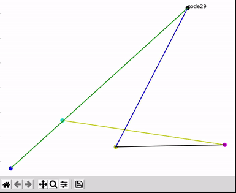

<!-- start_ppi_description -->
# Hamiltonian

Small engine to animate nodes and lines with matplotlib

I have (for now) no intent to release this code publicly, this will be used
internally in some future projects.

### Dumb demo: generate points, lines randomly and animate them randomly

<!-- end_ppi_description -->
